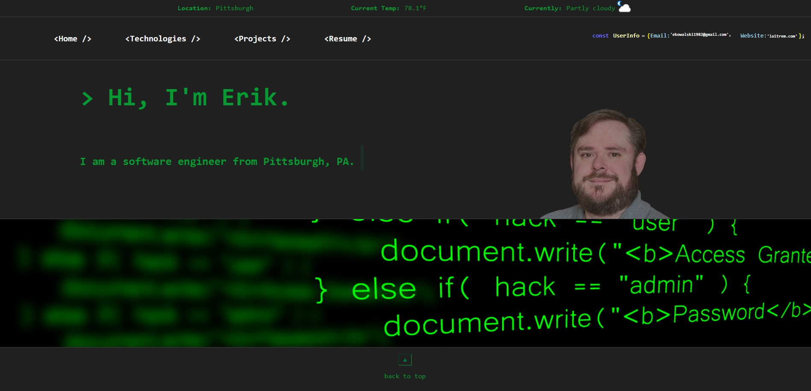

# My Portfolio

## This project was created with React

## My Approach
The approach I decided to take for this was to go for more of a programming/ retro / matrix vibe with the visuals

## You can view this project live at
[View the project live here](http://loitrem.tplinkdns.com/)

## Features include
- Home Page
- Typing Animation
- API calls
- Technologies known
- Projects
- Resume
- Current Weather
- Links to live versions of the projects

## APIs Used

 - Github
 - ipwho.is - geolocation
 - weatherapi.com
 - ipify.org - ip address

 

## Technologies Used

 - React
 - JavaScript
 - HTML
 - CSS

 

## Dependencies

 - Axios
 - Framer-motion
 - Typed.js

  

## Installation Instructions
If you wish to install this react app

 - Clone this github repository
 - Open the react app with VS Code
 - Run the command 'npm i' from the terminal
 - If you wish to view the app run the command 'npm start' from your terminal
 - If you want a production build you will first need to open the package.json file
 - Above the dependencies enter this line of code:  '"homepage": "http://YourSiteHere",'
 - After entering that line of code in package.json run the command 'npm run build' from your terminal
 - Once that has finished running you will have a build folder.
 - You can now open the build folder and take the contents and host them wherever you wish.

## This project is dynamically scaled from cellphone up to desktop

## Hooks used

 - useState
 - useContext
 - useNavigate
 - useEffect
